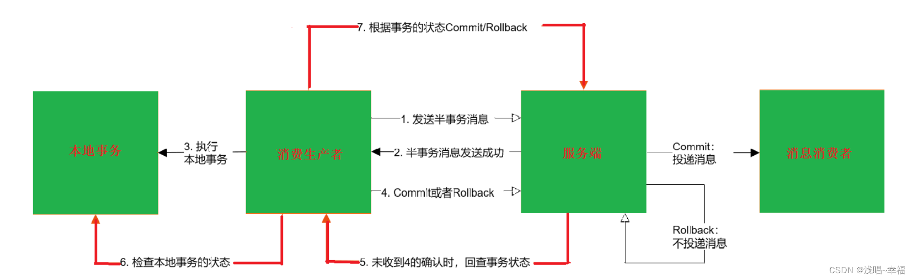

# 一、安装
- 下载server
  https://rocketmq.apache.org/zh/download
- 下载console
  https://github.com/apache/rocketmq-dashboard/releases/tag/rocketmq-dashboard-2.0.0

# 二、启动
## 1、先启动name server
```
start D:/program/rocketmq/bin/mqnamesrv.cmd
```
## 2、再启动broker
```
start D:/program/rocketmq/bin/mqbroker.cmd -n 0.0.0.0:9876 -c D:/program/rocketmq/conf/broker.conf
```
## 3、启动console
### 3.1、打包
```
mvn clean package -Dmaven.test.skip=true -T 4
```
### 3.2、启动
```
java -jar D:/program/rocketmq-dashboard-2.0.0.jar
```
### 3.3访问console
http://localhost:8080

# 三、事务消息

```
1.发送方向 MQ 服务端发送消息。
2.MQ Server 将消息持久化成功之后，向发送方 ACK 确认消息已经发送成功，此时消息为半消息。
3.发送方开始执行本地事务逻辑。
4.发送方根据本地事务执行结果向 MQ Server 提交二次确认（Commit 或是 Rollback），MQ Server 收到Commit 状态则将半消息标记为可投递，订阅方最终将收到该消息；MQ Server 收到 Rollback 状态则删除半消息，订阅方将不会接受该消息。
5.在断网或者是应用重启的特殊情况下，上述步骤4提交的二次确认最终未到达 MQ Server，经过固定时间后MQ Server 将对该消息发起消息回查。
6.发送方收到消息回查后，需要检查对应消息的本地事务执行的最终结果。
7.发送方根据检查得到的本地事务的最终状态再次提交二次确认，MQ Server 仍按照步骤4对半消息进行操作
```

# 四、参考
- [RocketMQ解决分布式事务问题](https://blog.csdn.net/qq_36737803/article/details/112360609)